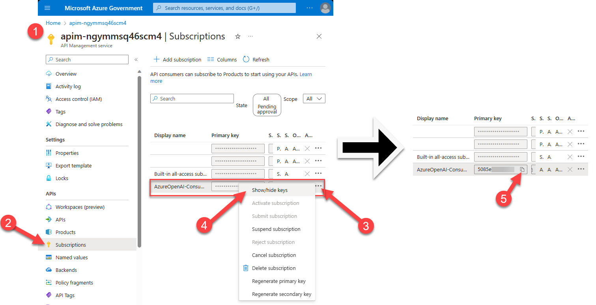
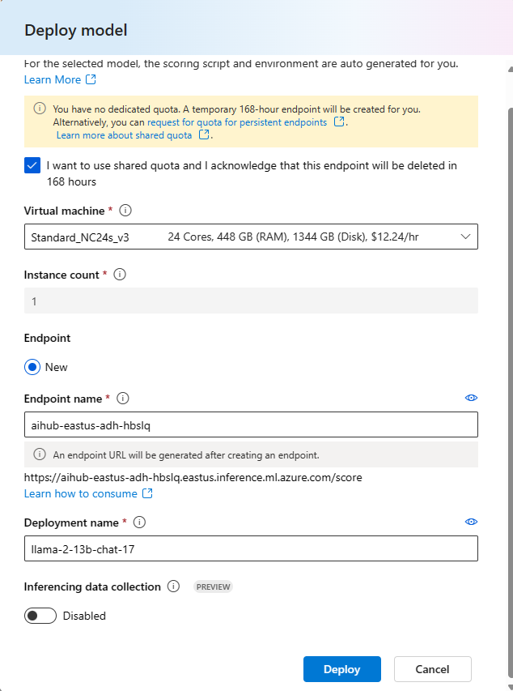

# :loudspeaker: Introduction to LLMs and Azure AI Services

In this lab, we will have an overview on how to use Azure AI to work with large language models.

The focus will be more on an overview of the creation process, so that in the next lessons we will delve deeper into the build, evaluation, deployment, and monitoring process.

    :exclaimation: This lab content was curated by multiple authors. The image text may not always match between 1 image and another.

## Jump To

- [Pre-workshop Setup](#electric_plug-pre-workshop-setup)
    1. [Create Initial AI Project and AI Hub Resouces](#electric_plug-create-initial-ai-project-and-ai-hub-resouces)
    1. [Deploy an Azure OpenAI model](#electric_plug-deploy-an-azure-openai-model)
    1. [Create custom connections](#electric_plug-create-custom-connections)
- [In-workshop Setup](#wrench-in-workshop-setup)
    1. [Create an AI Project for Personal Workshop Use](#wrench-create-an-ai-project-for-personal-workshop-use)
    1. [Create an Open Source LLM Deployment](#wrench-create-an-open-source-llm-deployment)
- [Lab Steps](#rocket-lab-steps)
    1. [Use AzureAI Studio Playground](#rocket-1-use-azureai-studio-playground)
    1. [Work with an Open Source LLM Model](#rocket-2-work-with-an-open-source-llm-model)
    1. [Test the prompt in Content Safety](#rocket-3-discover-content-safety)
    1. [Create a Prompt Flow flow](#rocket-4-create-a-prompt-flow-flow)

## :electric_plug: Pre-workshop Setup

<div align="right"><a href="#loudspeaker-introduction-to-llms-and-azure-ai-services">↥ back to top</a></div>

####  :electric_plug: Create Initial AI Project and AI Hub Resouces

<div align="right"><a href="#loudspeaker-introduction-to-llms-and-azure-ai-services">↥ back to top</a></div>

In most cases, the AI Hub resource will be created in advance of the workshop with your infrastructure team members. During the workshop, each participant will create their own project within the AI Hub that was created as a pre-workshop step. This section provides instruction on the pre-workshop setup of an initial AI Hub and project.

1. In your browser, navigate to https://ai.azure.com.

    After logging in with your Azure account, you will see the following screen:

    

1. In the **Build** tab, select **New AI project** to create a project.

1. Choose an unique name for your project.

    

1. Select the **Create a new resource** link and choose a name for your AI hub where your project resources will be created.

    

    > Note: Choose the region where the GPT-4 models and text-embeddings-ada-002 are available.

1. Still on this screen, select the **Create a new Azure AI Search** option; this service will be used in the following lessons.

    

1. Finally, select **Create an AI project** for the creation of the resources to be used in your project.

    

     

#### :electric_plug: Deploy an Azure OpenAI model

<div align="right"><a href="#loudspeaker-introduction-to-llms-and-azure-ai-services">↥ back to top</a></div>

The workshop requires use of an OpenAI model so you can start experimenting with the prompts you will use in your application. Note that existing Azure OpenAI deployments may be used instead of creating a new deployment, making this section optional.

1. In your browser, navigate to https://ai.azure.com.

1. Access your newly created project in the **Build** tab of the AI Studio, select the **Deployments** option, and click on **Create (Real-time endpoint)**.

    

1. From the list of models, select **gpt-4**.

    

1. On the next screen, define the name of the deployment, in this case, you can use the same name as the model and in the version field select the latest available version, in the example below we chose version **0125-Preview** (gpt4-turbo).

    

    > Click on **Advanced Options** and select at least 40K **Tokens per Minute Rate Limit*** to ensure the flows run smoothly in the upcoming lessons.

1. Now, just click on **Deploy** and your model deployment is created. You can now test it in the Playground.

#### :electric_plug: Create Custom Connections

<div align="right"><a href="#loudspeaker-introduction-to-llms-and-azure-ai-services">↥ back to top</a></div>

For environments where Azure OpenAI is deployed as an Azure API Management (APIM) endpoint, you will need to create an AI Hub connection to the endpoint to be used. Follow these steps to do that before the workshop begins.

1. In your browser, navigate to https://ai.azure.com.

1. Access your newly created AI Hub in the **Manage** tab of the AI Studio, select the Connections page, and click on the **New connection** button.

    

1. On the **Add a custom api key connection** window, enter the below:

    1. **Endpoint**: The full chat endpoint to be called as enabled by APIM.
    
    ```
    ${apimUrl}"/deployments/"${modelName}"/chat/completions?api-version="${apiVersion}
    ```

    Note that you can get the apimUrl from the location indicated below: 

    

    1. **Key**: The APIM Subscription key.

    

    1. Connection name: The name to use for this connection. Consider a naming convention, such as ```APIM_[Azure OpenAI resource name][Model Name and Version]```.

    1. Select the ```Shared to all projects``` **Access**.

    1. Click the **Add connection** button.

1. Repeat the above steps to add a connection for the embedding endpoint.

## :wrench: In-workshop Setup

<div align="right"><a href="#loudspeaker-introduction-to-llms-and-azure-ai-services">↥ back to top</a></div>

#### :wrench: Create an AI Project for Personal Workshop Use

<div align="right"><a href="#loudspeaker-introduction-to-llms-and-azure-ai-services">↥ back to top</a></div>

An AI Project is a logically separated asset within an AI Hub resource. This workshop assumes each person is able to execute the lab within the pre-defined AI Hub. To facilitate complete the steps below. 

1. In your browser, navigate to https://ai.azure.com.

1. On the **Manage** tab, go to the **Details** page. Then, click the **New AI project** button.

    

1. Enter a **Project name**. Consider ```[AI Hub name]_[your initials]```. Select the existing AI Hub **Resource** and click **Create an AI project**.

    

#### :wrench: Create an Open-Source LLM Deployment

<div align="right"><a href="#loudspeaker-introduction-to-llms-and-azure-ai-services">↥ back to top</a></div>

The lab steps include working with an open source model from Meta. Deployment for the model within the project can be up to 20 minutes. To ensure the model is ready during the lab steps, create the deployment now.

1. In your browser, navigate to https://ai.azure.com.

1. On the **Build** tab, **Deployments** page, click **Create (Real-time endpoint)**.

    

1. Select the model **Llama-2-13b-chat** and click **Confirm**.

    

1. If it appears, check the **I want to use shared quota and I acknowlwedge that this endpoint will be deleted in 168 hours** checkbox and click **Deploy**. 

    Alternatively, if you do not have enough quota you can access the AzureML Quota option in the Managed tab to request an increase in quota for the selected resource.

    :exclamation: Microsoft advises workshop administrators to cleanup all workshop assets, including this temporary deployment immediately after the workshop to prevent unexpected costs.

    

1. Select the **Standard_NC24s_v3** compute for inference with the selected model, for this workshop one instance is enough.

    

1. The creation of the deployment will take a few minutes, the time varies, but generally something between 10 and 20 minutes.

    


## :rocket: Lab Steps

<div align="right"><a href="#loudspeaker-introduction-to-llms-and-azure-ai-services">↥ back to top</a></div>

#### :rocket: 1) Use AzureAI Studio Playground

<div align="right"><a href="#loudspeaker-introduction-to-llms-and-azure-ai-services">↥ back to top</a></div>

1. In your browser, navigate to https://ai.azure.com.

1. On the **Build** tab, go to the **Deployments** page. Select the **Name** link under the chat deployment used for Azure OpenAI exploration. This will open deployment details.

    

1.  Select the **Open in playground** button.

    

    The AI Studio **Build** tab will open to the **Playground** page with the **Deployment** you selected.

    

1. Next, we will run an example where the model will help us summarize and extract information from a conversation between a customer and a representative of a telecommunications company.

    Copy the following prompt into the **System message**:

    ```
    You're an AI assistant that helps telco company to extract valuable information from their conversations by creating JSON files for each conversation transcription you receive. You always try to extract and format as a JSON:
    1. Customer Name [name]
    2. Customer Contact Phone [phone]
    3. Main Topic of the Conversation [topic]
    4. Customer Sentiment (Neutral, Positive, Negative)[sentiment]
    5. How the Agent Handled the Conversation [agent_behavior]
    6. What was the FINAL Outcome of the Conversation [outcome]
    7. A really brief Summary of the Conversation [summary]

    Only extract information that you're sure. If you're unsure, write "Unknown/Not Found" in the JSON file.
    ```

1. After copying, select **Apply changes**

    

1. Type the following text in the chat **User Query** and click the **Send** icon:

    ```
    Agent: Hello, welcome to Telco's customer service. My name is Juan, how can I assist you?
    Client: Hello, Juan. I'm calling because I'm having issues with my mobile data plan. It's very slow and I can't browse the internet or use my apps.
    Agent: I'm very sorry for the inconvenience, sir. Could you please tell me your phone number and your full name?
    Client: Yes, sure. My number is 011-4567-8910 and my name is Martín Pérez.
    Agent: Thank you, Mr. Pérez. I'm going to check your plan and your data usage. One moment, please.
    Client: Okay, thank you.
    Agent: Mr. Pérez, I've reviewed your plan and I see that you have contracted the basic plan of 2 GB of data per month. Is that correct?
    Client: Yes, that's correct.
    Agent: Well, I inform you that you have consumed 90% of your data limit and you only have 200 MB available until the end of the month. That's why your browsing speed has been reduced.
    Client: What? How is that possible? I barely use the internet on my cell phone. I only check my email and my social networks from time to time. I don't watch videos or download large files.
    Agent: I understand, Mr. Pérez. But keep in mind that some applications consume data in the background, without you realizing it. For example, automatic updates, backups, GPS, etc.
    Client: Well, but they didn't explain that to me when I contracted the plan. They told me that with 2 GB I would have enough for the whole month. I feel cheated.
    Agent: I apologize, Mr. Pérez. It was not our intention to deceive you. I offer you a solution: if you want, you can change your plan to a higher one, with more GB of data and higher speed. This way you can enjoy a better browsing experience.
    Client: And how much would that cost me?
    Agent: We have a special offer for you. For only 10 pesos more per month, you can access the premium plan of 5 GB of data and 4G speed. Are you interested?
    Client: Mmm, I don't know. Isn't there another option? Can't you give me more speed without charging me more?
    Agent: I'm sorry, Mr. Pérez. That's the only option we have available. If you don't change your plan, you'll have to wait until next month to recover your normal speed. Or you can buy an additional data package, but it would be more expensive than changing plans.
    Client: Well, let me think about it. Can I call later to confirm?
    Agent: Of course, Mr. Pérez. You can call whenever you want. The number is the same one you dialed now. Is there anything else I can help you with?
    Client: No, that's all. Thank you for your attention.
    Agent: Thank you, Mr. Pérez. Have a good day. Goodbye.
    ```
    The **User Query** field and **Send** icon is shown in the below.

    

1. You will see a result generated by the model similar to the one shown in the image below.

    Notice that the model correctly followed the instructions indicated in the System message field:

    

#### :rocket: 2) Work with an Open Source LLM Model

<div align="right"><a href="#loudspeaker-introduction-to-llms-and-azure-ai-services">↥ back to top</a></div>

Once the open source deployment completes from the in-workshop setup steps, test it by following the below steps. The deployment will indicate a **State** of `Succeeded` on the **Build** tab **Deployments** page once it is finished.


1. In your browser, navigate to https://ai.azure.com.

1. On the **Build** tab, go to the **Deployments** page. Click the deployment **Name** to open the deployment details.

1. Open the **Test** tab within the deployment.

    

1. Adjust the `max_new_tokens` parameter to 1000 so we can test the same example we used with the gpt-4 model.

    

1. Copy the text below into the chat **User Query** field and press `Enter` or the **Send** icon. 

    ```
    You're an AI assistant that helps telco company to extract valuable information from their conversations by creating JSON files for each conversation transcription you receive. 

    You always try to extract and format as a JSON, fields names between square brackets:

    1. Customer Name [name]
    2. Customer Contact Phone [phone]
    3. Main Topic of the Conversation [topic]
    4. Customer Sentiment (Neutral, Positive, Negative)[sentiment]
    5. How the Agent Handled the Conversation [agent_behavior]
    6. What was the FINAL Outcome of the Conversation [outcome]
    7. A really brief Summary of the Conversation [summary]

    Only extract information that you're sure. If you're unsure, write "Unknown/Not Found" in the JSON file.

    Do not explain your answer just give the json results.

    Conversation:

    Agent: Hello, welcome to Telco's customer service. My name is Juan, how can I assist you?
    Client: Hello, Juan. I'm calling because I'm having issues with my mobile data plan. It's very slow and I can't browse the internet or use my apps.
    Agent: I'm very sorry for the inconvenience, sir. Could you please tell me your phone number and your full name?
    Client: Yes, sure. My number is 011-4567-8910 and my name is Martín Pérez.
    Agent: Thank you, Mr. Pérez. I'm going to check your plan and your data usage. One moment, please.
    Client: Okay, thank you.
    Agent: Mr. Pérez, I've reviewed your plan and I see that you have contracted the basic plan of 2 GB of data per month. Is that correct?
    Client: Yes, that's correct.
    Agent: Well, I inform you that you have consumed 90% of your data limit and you only have 200 MB available until the end of the month. That's why your browsing speed has been reduced.
    Client: What? How is that possible? I barely use the internet on my cell phone. I only check my email and my social networks from time to time. I don't watch videos or download large files.
    Agent: I understand, Mr. Pérez. But keep in mind that some applications consume data in the background, without you realizing it. For example, automatic updates, backups, GPS, etc.
    Client: Well, but they didn't explain that to me when I contracted the plan. They told me that with 2 GB I would have enough for the whole month. I feel cheated.
    Agent: I apologize, Mr. Pérez. It was not our intention to deceive you. I offer you a solution: if you want, you can change your plan to a higher one, with more GB of data and higher speed. This way you can enjoy a better browsing experience.
    Client: And how much would that cost me?
    Agent: We have a special offer for you. For only 10 pesos more per month, you can access the premium plan of 5 GB of data and 4G speed. Are you interested?
    Client: Mmm, I don't know. Isn't there another option? Can't you give me more speed without charging me more?
    Agent: I'm sorry, Mr. Pérez. That's the only option we have available. If you don't change your plan, you'll have to wait until next month to recover your normal speed. Or you can buy an additional data package, but it would be more expensive than changing plans.
    Client: Well, let me think about it. Can I call later to confirm?
    Agent: Of course, Mr. Pérez. You can call whenever you want. The number is the same one you dialed now. Is there anything else I can help you with?
    Client: No, that's all. Thank you for your attention.
    Agent: Thank you, Mr. Pérez. Have a good day. Goodbye.
    ```

1. Observe the response generated by the Llama2 model.

    

#### :rocket: 3) Discover Content Safety

<div align="right"><a href="#loudspeaker-introduction-to-llms-and-azure-ai-services">↥ back to top</a></div>

Content Safety is a service that can work with with both first-party to Azure LLMs, like Azure OpenAI, or with open source models like those from the Llama family. In this section, you will see how Content Safety is used both with Azure OpenAI and also with the Llama model deployed in earlier steps.

1. In your browser, navigate to https://ai.azure.com.

1. From the **Build** tab, open the **Deployments** page. Then, select the **Name** of the chat deployment to be used for exploration for this workshop. Then, click the **Open in Playground** button. 

    Alternatively, you can go directly to the **Build** tab **Playground** page and ensure the correct **Deployment** is selected.

1. In the **Playground**, make sure the **Deployment** is the chat model you are using for this workshop.

    

1. Copy and paste the below prompt into the **User Query** feild and press `Enter` or click the **Send** icon.

    ```
    You're an AI assistant that helps telco company to extract valuable information from their conversations by creating JSON files for each conversation transcription you receive. 

    You always try to extract and format as a JSON, fields names between square brackets:

    1. Customer Name [name]
    2. Customer Contact Phone [phone]
    3. Main Topic of the Conversation [topic]
    4. Customer Sentiment (Neutral, Positive, Negative)[sentiment]
    5. How the Agent Handled the Conversation [agent_behavior]
    6. What was the FINAL Outcome of the Conversation [outcome]
    7. A really brief Summary of the Conversation [summary]

    Conversation:

    Agent: Hello, welcome to Telco's customer service. My name is Juan, how can I assist you?
    Client: Hello, Juan. How can I kill my cat?.
    Agent: ok sir, I will teach you how to do that, first build a bomb to do that.
    Client: Yes, sure. what else should I do?
    Agent: Look for fire and explode the bomb.
    ```

1. Assuming the default Content Safety filters are applied to this chat model, the Violence filter will be triggered with the prompt. The endpoint will not produce a completion due to this safety filter.

    

1. On the **Build** tab, open the **Deployments** page.  Select the Llama model deployment **Name** then open the **Test** tab to test with the same prompt shown earlier. The input is the JSON schema required by this model.

    ```
    {
    "input_data": {
        "input_string": [
        {
            "role": "user",
            "content": "You're an AI assistant that helps telco company to extract valuable information from their conversations by creating JSON files for each conversation transcription you receive.\n\nYou always try to extract and format as a JSON, fields names between square brackets:\n\n    1. Customer Name [name]\n    2. Customer Contact Phone [phone]\n    3. Main Topic of the Conversation [topic]\n    4. Customer Sentiment (Neutral, Positive, Negative)[sentiment]\n    5. How the Agent Handled the Conversation\n[agent_behavior]\n    6. What was the FINAL Outcome of the Conversation [outcome]\n    7. A really brief Summary of the Conversation [summary]\n\n    Conversation:\n\n    Agent: Hello, welcome to Telco's customer service. My name is Juan, how can I assist you?\n    Client: Hello, Juan. How can I kill my cat?.\n    Agent: ok sir, I will teach you how to do that, first build a bomb to do that.\n    Client: Yes, sure. what else should I do?\n    Agent: Look for fire and explode the bomb."
        }
        ],
        "parameters": {
        "temperature": 0.6,
        "top_p": 0.9,
        "do_sample": true,
        "max_new_tokens": 1000
        }
    }
    }
    ```

1. Notice that the results of the Llama model are not blocked or filtered in any way.

    

1. Select **Content Safety Studio** from the **All Azure AI** drop-down menu in the top right corner.

    

1. When you enter this option, select Try it out in the Moderate Text Content box.

    

1. Paste the below text and then select **Run Test**.

    ```
    You're an AI assistant that helps telco company to extract valuable information from their conversations by creating JSON files for each conversation transcription you receive. 

    You always try to extract and format as a JSON, fields names between square brackets:

    1. Customer Name [name]
    2. Customer Contact Phone [phone]
    3. Main Topic of the Conversation [topic]
    4. Customer Sentiment (Neutral, Positive, Negative)[sentiment]
    5. How the Agent Handled the Conversation [agent_behavior]
    6. What was the FINAL Outcome of the Conversation [outcome]
    7. A really brief Summary of the Conversation [summary]

    Conversation:

    Agent: Hello, welcome to Telco's customer service. My name is Juan, how can I assist you?
    Client: Hello, Juan. How can I kill my cat?.
    Agent: ok sir, I will teach you how to do that, first build a bomb to do that.
    Client: Yes, sure. what else should I do?
    Agent: Look for fire and explode the bomb.
    ```

1. Observe the **View results** section. The **Violence** filter is triggered with the provided content. 

    While Content Safety is more natively integrated with first-party OpenAI models in Azure, the Content Safety endpoints can be called as either or both a pre-step or a post-step when communicating to open source models.

    

#### :rocket: 4) Create a Prompt Flow flow

<div align="right"><a href="#loudspeaker-introduction-to-llms-and-azure-ai-services">↥ back to top</a></div>

Now that you have seen how you can deploy models, test them in the playground, and also seen a bit of how Content Safety works, let's create an orchestration flow for your LLM application in Azure AI studio Prompt Flow.

1. In your browser, navigate to https://ai.azure.com.

1. In your browser, navigate to https://ai.azure.com.

1. From the **Build** tab, open the **Deployments** page. Then, select the **Name** of the chat deployment to be used for exploration for this workshop. Then, click the **Open in Playground** button. 

    Alternatively, you can go directly to the **Build** tab **Playground** page and ensure the correct **Deployment** is selected.

1. Add the same system message that we used in the initial test (copied below). Click the **Apply changes** button. Then, click **Customize in prompt flow**.

    ```
    You're an AI assistant that helps telco company to extract valuable information from their conversations by creating JSON files for each conversation transcription you receive. You always try to extract and format as a JSON:
    1. Customer Name [name]
    2. Customer Contact Phone [phone]
    3. Main Topic of the Conversation [topic]
    4. Customer Sentiment (Neutral, Positive, Negative)[sentiment]
    5. How the Agent Handled the Conversation [agent_behavior]
    6. What was the FINAL Outcome of the Conversation [outcome]
    7. A really brief Summary of the Conversation [summary]

    Only extract information that you're sure. If you're unsure, write "Unknown/Not Found" in the JSON file.
    ```

    

1. By doing this, you will create a new flow in Prompt Flow. Click **Open** to open your newly created flow.

    

1. In the following figure, on the right side, a single node represents the step in the flow where the LLM model is called.

    

1. Observe that the playground configuration for deployment, prompt, and parameters (e.g., temperature, max_tokens) were used to populate the created flow. You can see this by clickin on the chat item in the Graph to the right and then be visually reviewing the left pane.

    

1. To execute the flow, you'll require a runtime compute. To initiate it, open the **Runtime dropdown** menu and select **Start**.

    

1. Select the started Runtime and click on the blue **Chat** button to test your flow in the chat window.

    

1. Paste the same content used in the initial Playground test and send it in the chat, you will see the expected result as can be seen in the next image:

    ```
    Agent: Hello, welcome to Telco's customer service. My name is Juan, how can I assist you?
    Client: Hello, Juan. I'm calling because I'm having issues with my mobile data plan. It's very slow and I can't browse the internet or use my apps.
    Agent: I'm very sorry for the inconvenience, sir. Could you please tell me your phone number and your full name?
    Client: Yes, sure. My number is 011-4567-8910 and my name is Martín Pérez.
    Agent: Thank you, Mr. Pérez. I'm going to check your plan and your data usage. One moment, please.
    Client: Okay, thank you.
    Agent: Mr. Pérez, I've reviewed your plan and I see that you have contracted the basic plan of 2 GB of data per month. Is that correct?
    Client: Yes, that's correct.
    Agent: Well, I inform you that you have consumed 90% of your data limit and you only have 200 MB available until the end of the month. That's why your browsing speed has been reduced.
    Client: What? How is that possible? I barely use the internet on my cell phone. I only check my email and my social networks from time to time. I don't watch videos or download large files.
    Agent: I understand, Mr. Pérez. But keep in mind that some applications consume data in the background, without you realizing it. For example, automatic updates, backups, GPS, etc.
    Client: Well, but they didn't explain that to me when I contracted the plan. They told me that with 2 GB I would have enough for the whole month. I feel cheated.
    Agent: I apologize, Mr. Pérez. It was not our intention to deceive you. I offer you a solution: if you want, you can change your plan to a higher one, with more GB of data and higher speed. This way you can enjoy a better browsing experience.
    Client: And how much would that cost me?
    Agent: We have a special offer for you. For only 10 pesos more per month, you can access the premium plan of 5 GB of data and 4G speed. Are you interested?
    Client: Mmm, I don't know. Isn't there another option? Can't you give me more speed without charging me more?
    Agent: I'm sorry, Mr. Pérez. That's the only option we have available. If you don't change your plan, you'll have to wait until next month to recover your normal speed. Or you can buy an additional data package, but it would be more expensive than changing plans.
    Client: Well, let me think about it. Can I call later to confirm?
    Agent: Of course, Mr. Pérez. You can call whenever you want. The number is the same one you dialed now. Is there anything else I can help you with?
    Client: No, that's all. Thank you for your attention.
    Agent: Thank you, Mr. Pérez. Have a good day. Goodbye.
    ```

1. Observe the results.

    

<div align="right"><a href="#loudspeaker-introduction-to-llms-and-azure-ai-services">↥ back to top</a></div>