#### Building LLMs Orchestration Flows

Learn how to build prompt flow orchestrations for your LLM App.

During this lab, we will cover the following steps:

1) Create a standard classification flow.
2) Create a conversational RAG flow.

#### Setup: Create a project in Azure AI Studio

If you are running this Lab after lesson 1, you don't need to worry about this step.

Otherwise, simply execute step 1 of lesson 1, which is to create a project in Azure AI Studio.

#### 1) Create a standard classification flow

Open your web browser and navigate to: https://ai.azure.com

Enter the **Build** menu and then select the **Prompt flow** option and click on the blue "Create" button.

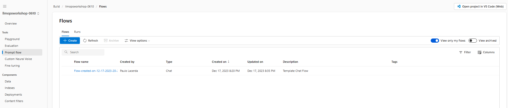

We will create a Standard flow for classifying websites on the internet.

In the flow creation window, select the **Standard flow** filter in the **Explore gallery** section.

Then, click on the "Clone" button in the Web Classification box.


Use the default name for the flow, or if you prefer, define a name of your preference and click on **Clone**.

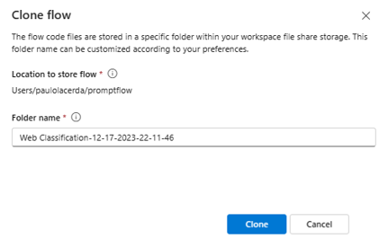

A Standard flow will be created with the following structure:

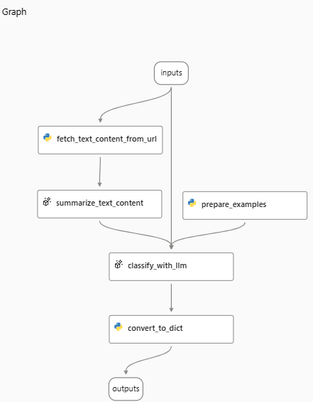

Notice that the flow has five nodes, the first `fetch_text_content_from_url` is a python node to extract the text from a Web page.

Then the content obtained by the extraction serves as input for an LLM node `summarize_text_content` to summarize the content.

The summarization, combined with the classification examples generated by a python node `prepare_examples` is the input for another LLM node `classify_with_llm` where the classification is performed.

At the end, we have a Python node `convert_to_dict` responsible for formatting the output of the flow in a python dictionary format.

Now that the flow has been created, we need a runtime to execute it in the Prompt Flow.

Select **Start** in the runtime dropdown to start a runtime to run your flow:

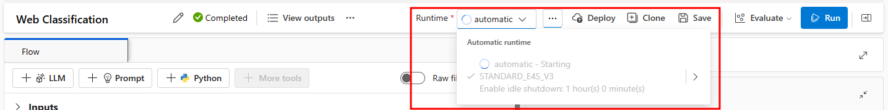

After selecting the Runtime, we need to define the Connection with the LLM for each LLM step. In our case, these are `summarize_text_content` and `classify_with_llm`.

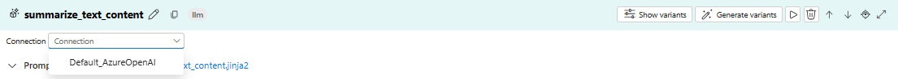

We will use the `Default_AzureOpenAI` Connection, which connects to the Azure OpenAI resource created when the Azure AI project was created.

If you completed the first lesson, you will have available in this resource a `gpt-4` deployment to select, otherwise create a new deployment as described in *step 2* of *Lab 01*.

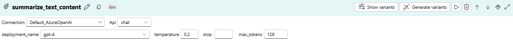

Associate the same Connection for the `classify_with_llm` step:

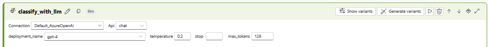

>> Note: you can leave the `response_format` field in blank or select the `{"type":"text"}`.

Once the Runtime is selected and the Connections are configured, you can start the flow by clicking the **Run** button at the top of the page.

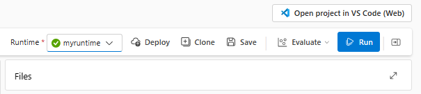

The input required for the flow execution is specified in its input section.

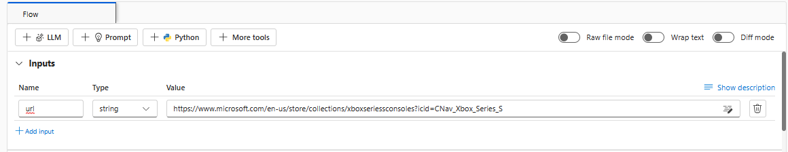

After finishing the execution you will see that the flow is complete with all steps.

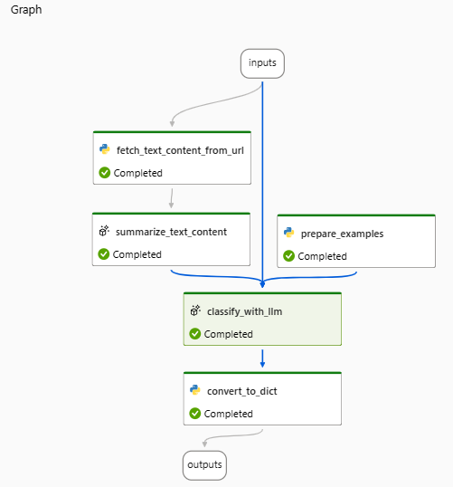

You can view the result of the processing in the last node.

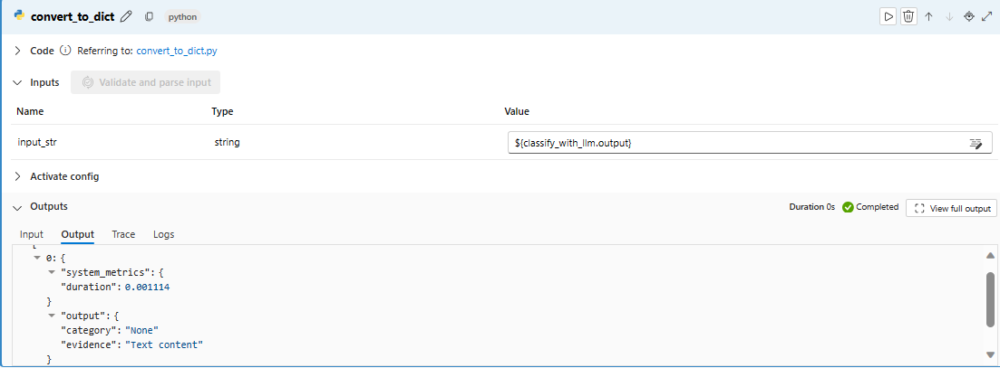

#### 2) Create a conversational RAG flow

To create a conversational flow using the RAG pattern, start by creating a new flow in the Prompt Flow section within the **Build** area.

Select the **Multi-Round Q&A** on Your Data template.

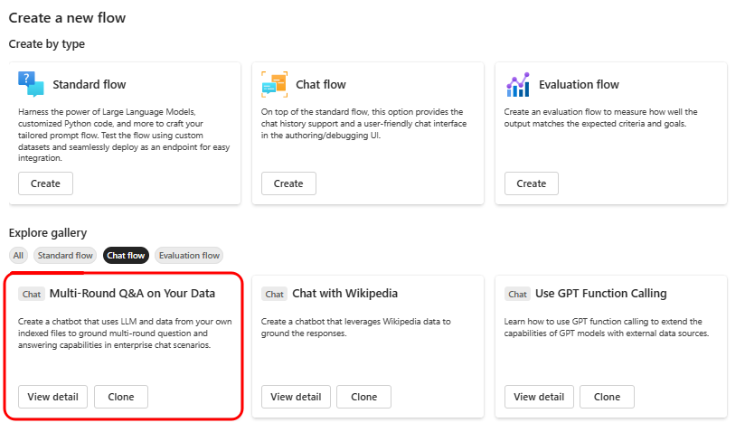

A flow with the following structure will be created.

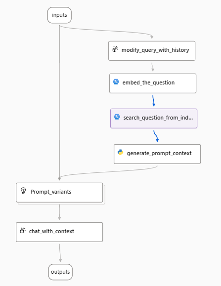

##### 2.1) Flow overview

The first node, `modify_query_with_history`, produces a search query using the user's question and their previous interactions. Next, in the `embed_the_question` node, the user's question is transformed into an embedding using the text-embedding-ada-002 model. This embedding is then used in the `search_question_from_indexed_docs` step to conduct a search within a vector store, which is where the RAG pattern retrieval takes place. Following the search process, the `generate_prompt_context` node consolidates the results into a string. This string then serves as input for the `Prompt_variants` node, which formulates various prompts. Finally, these prompts are used to generate the user's answer in the `chat_with_context` node.

##### 2.2) Search index

Before you can start running your flow, a crucial step is to establish the search index for the Retrieval stage. This search index will be provided by the Azure AI Search service. If you don't already have an instance of this service, you will need to set one up.  
   
Creating an instance of the Azure AI Search service is straightforward. You can do this by navigating to the **Azure Portal**, clicking on the **Create a resource** icon, searching for Azure AI Search, and then clicking on `Create`.  
   
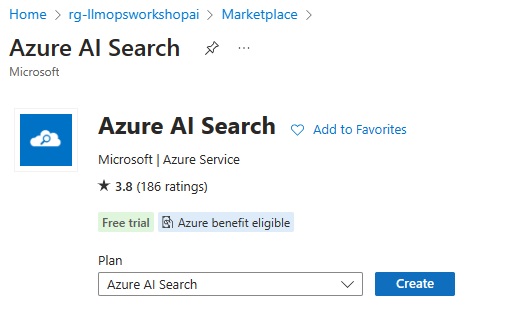
   
This is the creation page for the search service.  

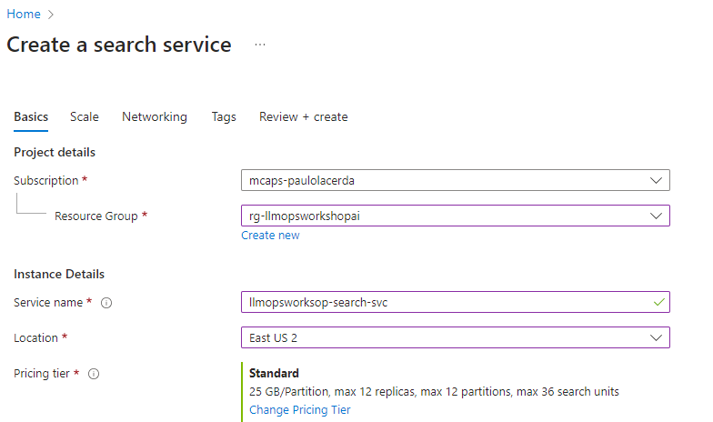
   
After creating the search service, you can create the index. 

In our case, we will make a Vector index. To do this, you just need to go back to the project in the **AI Studio**, select the **Indexes** option, and then click on the **New index** button.  
   
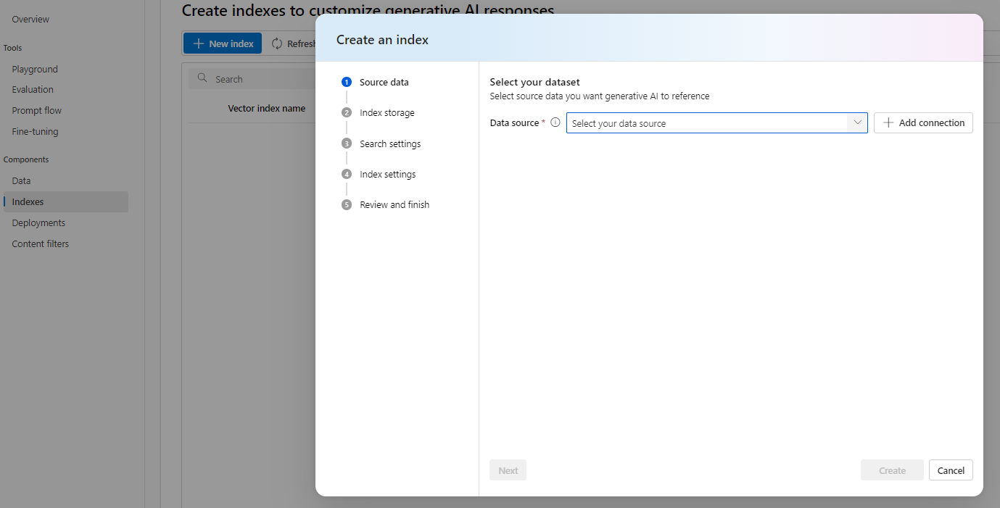
   
At the `Source data` stage, select the `Upload files/folders` option and upload the PDF `files/surface-pro-4-user-guide-EN.pdf` to the data folder of this lab, as shown in the next screen.  
   
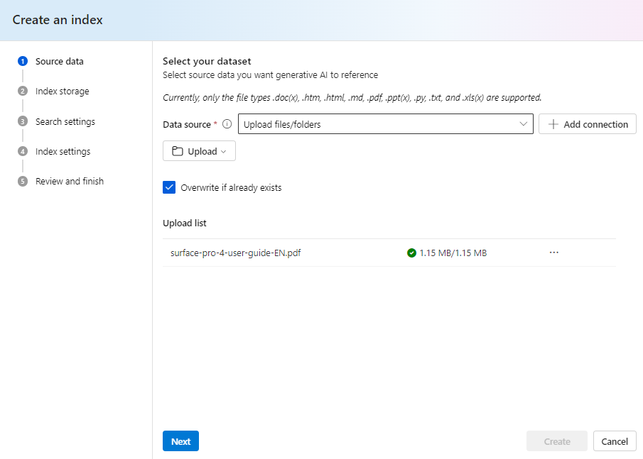
   
In `Index storage`, select the Search Service you created earlier.  

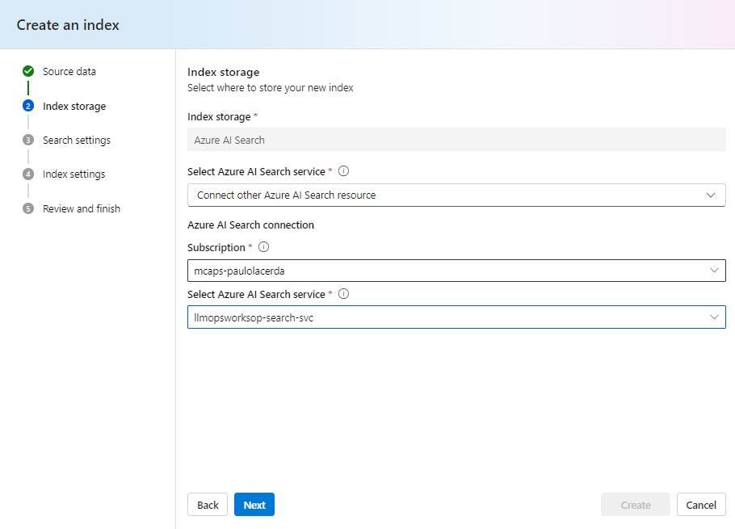
   
Under `Search settings`, select **Add vector search to this ...** as indicated in the following image.  
   
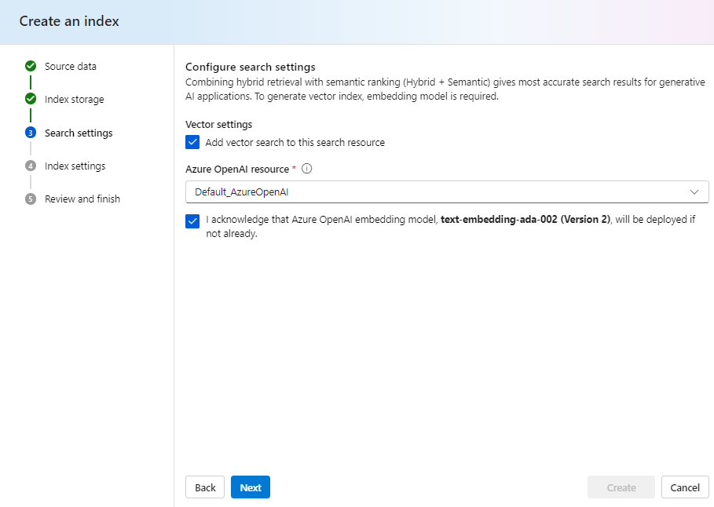
   
In `Index settings`, keep the default options as indicated below.  
   
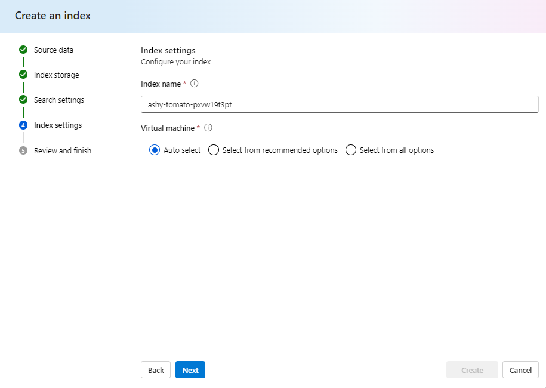
   
> Note: If you want to select a virtual machine configuration, click on the `Select from recommended options`. If you don't select, the default configuration will use serverless processing.

Great, now just click on the **Create** button at the `Review and finish` stage.  
   
The indexing job will be created and submitted for execution, so please wait a while for it to complete. 

It may take about 10 minutes from the time it enters the execution queue until it starts.  
   
Wait until the index status is `Ready` as in the next image, before proceeding with the next steps.  
   
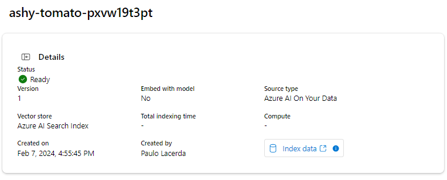

Before returning to the flow created in Prompt Flow, copy the path of the created index.

In order to do this, simply click on **Index data** in the **Details** section.  
   
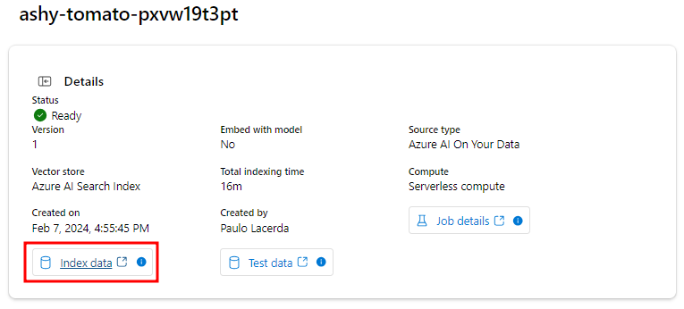
   
Next, copy the `Storage URI` in the **Data links** box.  
   
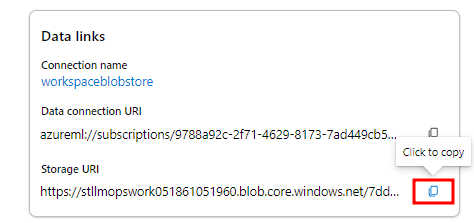

Return to the flow created in Prompt Flow to configure the `search_question_from_index_docs` node, where you will fill in the `path` field with the value of the `Storage URI` you just copied.

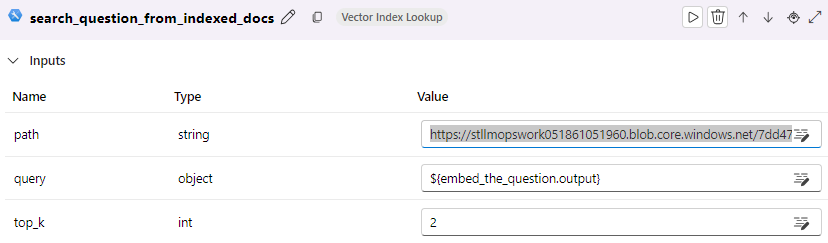

##### 2.3) Updating connection information

Now you will need to update the Connections of the nodes that link with LLM models.  
   
Starting with the `embed_the_question` node, in the `Inputs` section select the `Default_AzureOpenAI` in the connection field and ```text-embedding-ada-002``` in the deployment_name.  
   
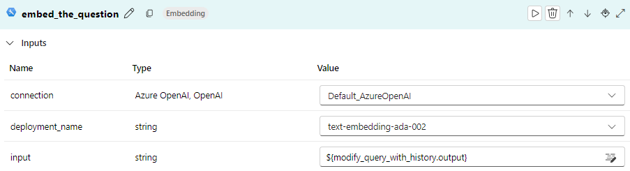

Then update the Connection in the `modify_query_with_history` node with the gpt-4 deployment, as indicated below:

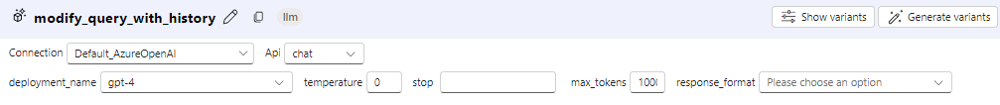

And the Connection for the `chat_with_context node` with the gpt-4 deployment, as indicated below:

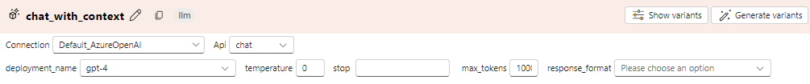

##### 2.4) Testing your RAG flow

Everything is now set up for you to initiate your chat flow. Simply click on the blue **Chat** button located at the top right corner of your page to begin interacting with the flow.

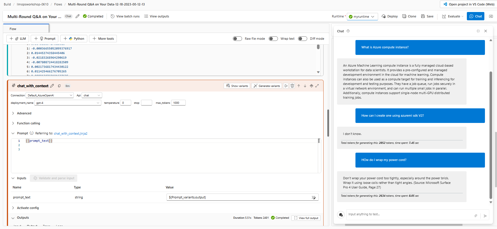