# :loudspeaker: Building LLMs Orchestration Flows

Learn how to build prompt flow orchestrations for your LLM App.

    :exclaimation: This lab content was curated by multiple authors. The image text may not always match between 1 image and another.

## Prerequisites

If you are running this lab after lesson 1, you don't need to worry about this step. Otherwise, follow the **Pre-workshop Setup** and **In-workshop Setup** from [Lesson 1](../lesson_01/lab01.md) to create a project and its associated resources in Azure AI Studio, as well as to deploy the Azure OpenAI chat model.

## Jump To

- [In-workshop Setup](#wrench-in-workshop-setup)
    - [Create a vector index](#wrench-create-a-vector-index)
- [Lab Steps](#rocket-lab-steps)
    1. [Create a standard classification flow](#rocket-1-create-a-standard-classification-flow)
    1. [Create a conversational RAG flow](#rocket-2-create-a-conversational-rag-flow)

## :wrench: In-workshop Setup

<a href="#loudspeaker-building-llms-orchestration-flows">↥ back to top</a>

#### :wrench: Create a vector index

<a href="#loudspeaker-building-llms-orchestration-flows">↥ back to top</a>

The [Create a conversational RAG flow](#rocket-1-create-a-conversational-rag-flow) section requires an established search index. It takes a few minutes to index the data, so this step should be completed first.

The AI Search service was originally created in the **Setup** section of this lab. If you have not yet created the Search service, you will need to set one up as explained below. With the search service created, you can now proceed to create the index.

In our case, we will create a **Vector index**. 

1. In the **Build** tab, select the **Indexes** page, and then click on the **New index** button.

    

1. Download the file [files/surface-pro-4-user-guide-EN.pdf](./files/surface-pro-4-user-guide-EN.pdf).

1. Select the **Data source** `Upload files/folders` and upload the PDF you downloaded in the previous step. Then, click **Next**.

    

1. In `Index storage`, select the Search Service that is the default for this AI Hub. Note that there can be more than 1 AI Search connection. Ask the host which is appropriate if needed.

    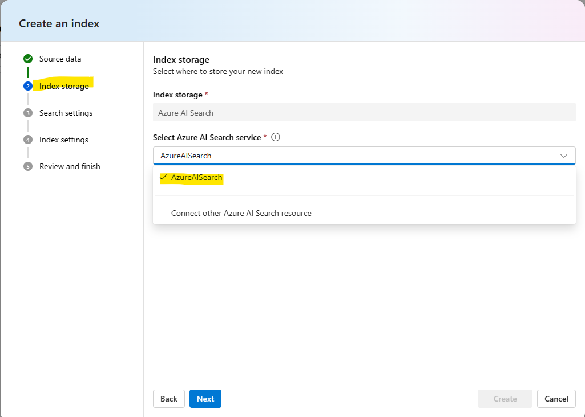
   
1. Under `Search settings`, check the two boxes as indicated below and click Next. 

    :exclaimation: Note that a text-embedding-ada-002 model will be deployed to this Azure OpenAI instance if one is not already deployed. This is a requirement for using the low-code AI Studio's Indexes user interface for building the AI Search. To use a different model, you must *currently* ingest the data to the index outside of AI Studio.

    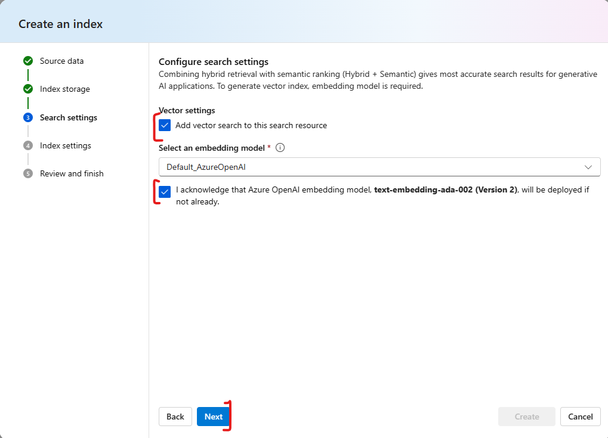

1. In `Index settings`, keep the default options as indicated below and click **Next**.
   
    
   
    > Note: If you want to select a virtual machine configuration, click on the **Select from recommended options**. If you don't select, the default configuration will use serverless processing.

1. Click on the **Create** button on the `Review and finish` page.  The indexing job will be created and submitted for execution. It may take about 10 minutes from the time it enters the execution queue until it starts. Leave this to run while you proceed with the [Lab Steps](#rocket-lab-steps).

## :rocket: Lab Steps

<a href="#loudspeaker-building-llms-orchestration-flows">↥ back to top</a>

#### :rocket: 1) Create a standard classification flow

<a href="#loudspeaker-building-llms-orchestration-flows">↥ back to top</a>

1. In your browser, navigate to https://ai.azure.com.

1. Select your AI project.

1. Then, in the **Build** menu, select the **Prompt flow** page and click on the blue **Create** button.

    

1. We will create a flow for classifying websites on the internet. In the **Create a new flow** window, select the **Standard flow** filter in the **Explore gallery** section. Then, click on the **Clone** button in the Web Classification box.

    

1. Use the default name for the flow, or if you prefer, define a name of your preference and click on **Clone**.

    

1. Select **Start** in the runtime dropdown to start a runtime.

    

1. While the runtime is starting, observe the assets created. Click and drag the **Graph** nodes to experiment with the **Graph** capabilities.

    

    Notice that the flow has five nodes, the first `fetch_text_content_from_url` is a python node to extract the text from a Web page.

    Then the content obtained by the extraction serves as input for an LLM node `summarize_text_content` to summarize the content.

    The summarization, combined with the classification examples generated by a python node `prepare_examples` is the input for another LLM node `classify_with_llm` where the classification is performed.

    At the end, we have a Python node `convert_to_dict` responsible for formatting the output of the flow in a python dictionary format.

    Now that the flow has been created, we need a runtime to execute it in the Prompt Flow.

1. After the runtime is started, we need to define the **Connection** with the LLM for each LLM step. In this flow, these are `summarize_text_content` and `classify_with_llm`.

    Go to the input section for the summarize_text_content node and set the **Connection** to the chat model deployment that is communicated by the presenter as targetted for this workshop.

    

1. Associate the same **Connection** for the `classify_with_llm` step:

    

    > Note: You can leave the `response_format` field in blank or select the `{"type":"text"}`.

1. Start the flow by clicking the **Run** button at the top of the page.

    

1. On the **Graph** pane, click the `inputs` item to quickly navigate to the inputs on the **Flow** pane. The input required for the flow execution is specified in its input section. Review the **Flow** pane `outputs` node as well.

    

1. After finishing the execution you will see that the flow is complete with all steps.

    

1. The output is specififed in the **Flow** pane `Outputs` node. However, it is usually the result of the last node, which you can quickly scroll to the bottom of the **Flow** pane to see.

    

#### :rocket: 2) Create a conversational RAG flow

<a href="#loudspeaker-building-llms-orchestration-flows">↥ back to top</a>

In this section, you will create a conversational flow using the RAG pattern. Before you get started, you will need to ensure the index you created as part of the [In-workshop Setup: Create a vector index](#electric_plug-create-a-vector-index) section is completed.

1. In your browser, navigate to https://ai.azure.com.

1. Select your AI project, if it is not already selected.

1. In the **Build** menu, select the **Indexes** page and visualy confirm that your index has a **Status** of `Ready`. 

    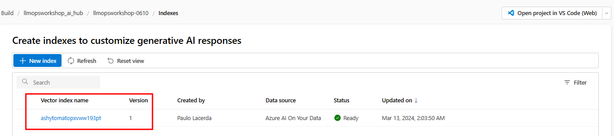

1. In the **Build** menu, select the **Prompt flow** page and click on the blue **Create** button. 

1. In the **Multi-Round Q&A on Your Data** template box, click **Clone**.

    

1. Start the automatic runtime by selecting **Start** in the **Runtime** drop down. 

    

1. Observe the assets created.

    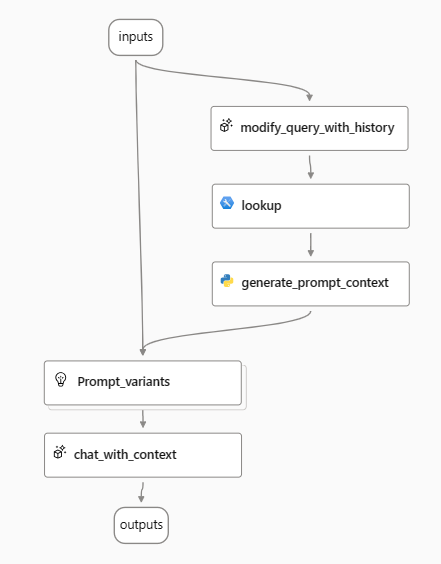

    The first node, `modify_query_with_history`, produces a search query using the user's question and their previous interactions. 
    
    Next, in the `lookup` node, the flow uses the vector index to conduct a search within a vector store, which is where the RAG pattern retrieval step takes place. 
    
    Following the search process, the `generate_prompt_context` node consolidates the results into a string. This string then serves as input for the `Prompt_variants` node.
    
    The `Prompt_variants` node formulates various prompts. 
    
    Finally, these prompts are used to generate the user's answer in the `chat_with_context` node.

1. Go to the `lookup` node and cick on `mlindex_content`.

    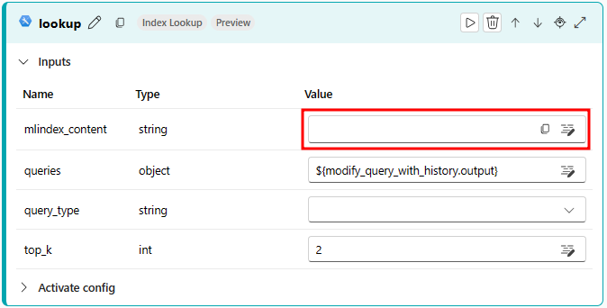

1. A **Generate** window will appear. In this window, select the `Registered Index` option from the `index_type` field. Then, choose version 1 of the index you just created, as shown in the following image. After making these selections, click on **Save**.

    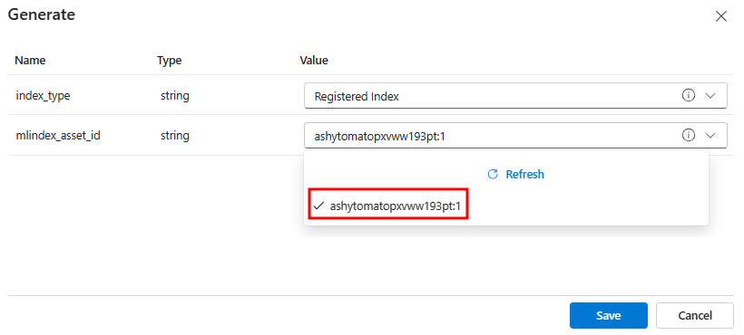

1. Now, let's go back to the `lookup` node. Select the `Hybrid (vector + keyword)` option from the query_type field, as shown in the subsequent image.

    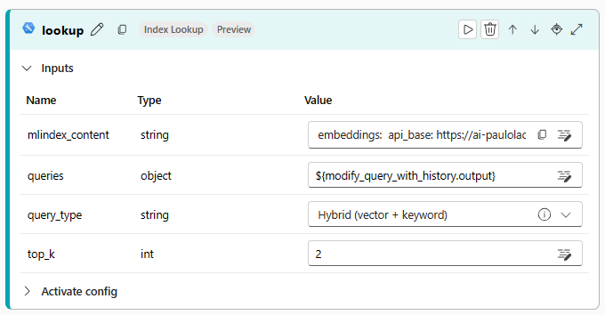

1. Update the **Connection** values of the nodes that link with LLM models (for this flow, that is  `modify_query_with_history` and `chat_with_context node` nodes).

    

    

1. Click the **Save** button to save your flow.

    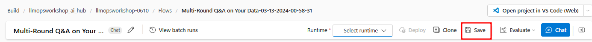

1. Observe the `samples.json` file contents. The first record in this file will load into the Chat history as part of the UI **Chat** button capability. When finished, close the samples.JSON file from the **Flow** pane.

    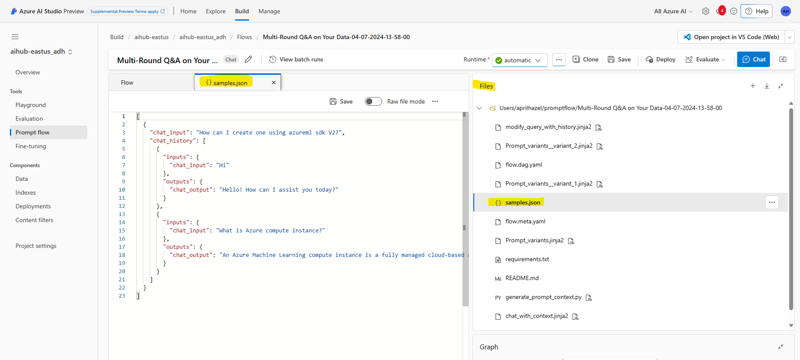

1. Everything is now set up for you to initiate your chat flow. Click on the blue **Chat** button located at the top right corner of your page to begin interacting with the flow.

    The Chat window will open with the `samples.JSON` file's first record. 

    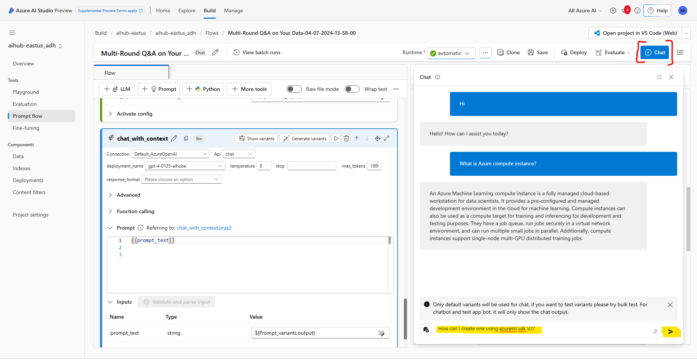
    
    Click the **Send** icon to get the chat response.

    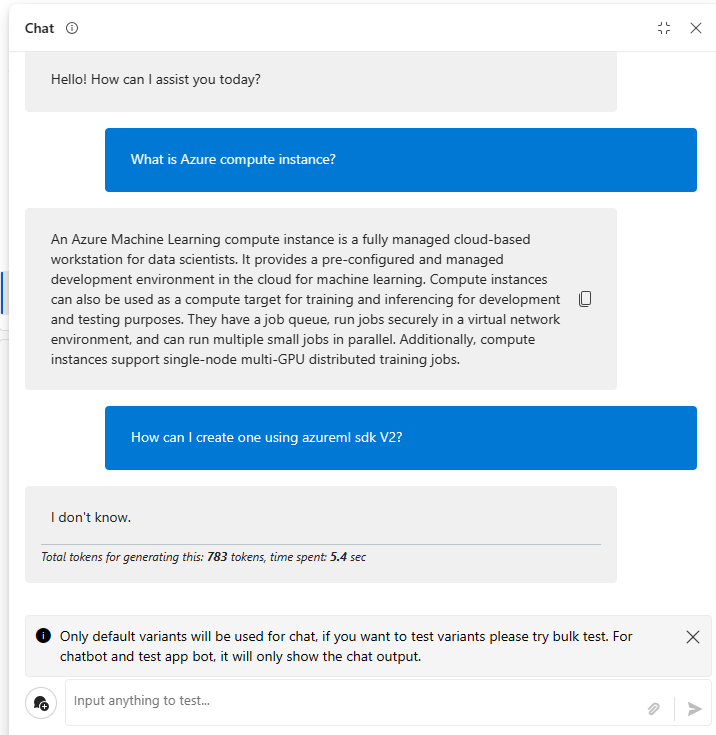

<a href="#loudspeaker-building-llms-orchestration-flows">↥ back to top</a>
