# :loudspeaker: Evaluating and Deploying LLMs

In this lab, you will have an overview on how to create flows that are used for evaluation purposes within AI Studio. 

[comment]: Reword above

    :exclaimation: This lab content was curated by multiple authors. The image text may not always match between 1 image and another.

## Pre-requisites

If you are running this lab after lesson 1, you don't need to worry about this step. Otherwise, follow the **Pre-workshop Setup** and **In-workshop Setup** from [Lesson 1](../lesson_01/lab01.md) to create a project and its associated resources in Azure AI Studio, as well as to deploy the Azure OpenAI chat model. 

In addition, the [Lesson 2](../lesson_02/lab02.md) content must also be complete as this lab builds on top of the conversational RAG flow build in that module.

## Jump To

- [In-workshop Setup](#wrench-in-workshop-setup)
    - [Create evaluation flows](#wrench-create-evaluation-flows)
- [Lab Steps](#rocket-lab-steps)
    1. [Evaluate your Chat flow](#rocket-1-evaluate-your-chat-flow)
    1. [Deploy the RAG flow to an online managed endpoint](#rocket-2-deploy-the-rag-flow-to-an-online-managed-endpoint)

## :wrench: In-workshop Setup

<a href="#loudspeaker-evaluating-and-deploying-llms">↥ back to top</a>

#### :wrench: Create evaluation flows

<a href="#loudspeaker-evaluating-and-deploying-llms">↥ back to top</a>

1. In your browser, navigate to https://ai.azure.com.

1. Select your AI project.

1. Then, in the **Build** menu, select the **Prompt flow** page. Click on the blue **Create** button.

    

1. Select the **Evaluation Flow** filter and click on **Clone** on the **QnA Groundedness Evaluation** card. Accept the default name and click **Clone** again.

    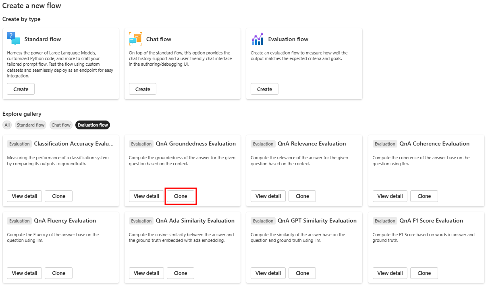

    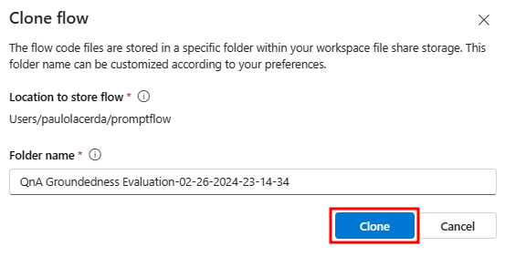

1. Observe the assets created.

    

1. Update the `Connection` field to point to the chat deployment used by this workshop in the `groundedness_score` node and update max_tokens to `1000` as shown below.
    
    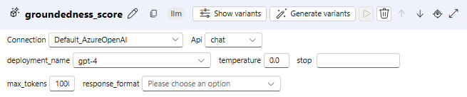

1. Click on **Save** in the evaluation flow.

1. Repeat the above steps for 2 additional evaluation flows:

    1. `QnA Relevance Evaluation`

        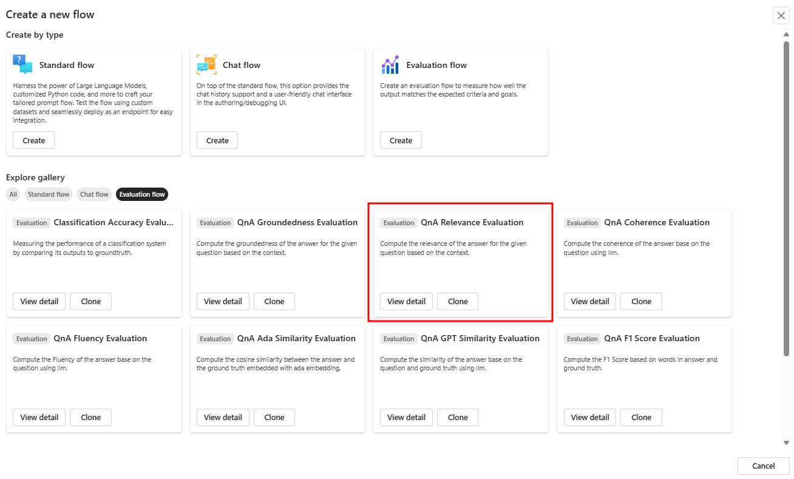
    
    1. `QnA GPT Similarity Evaluation`

        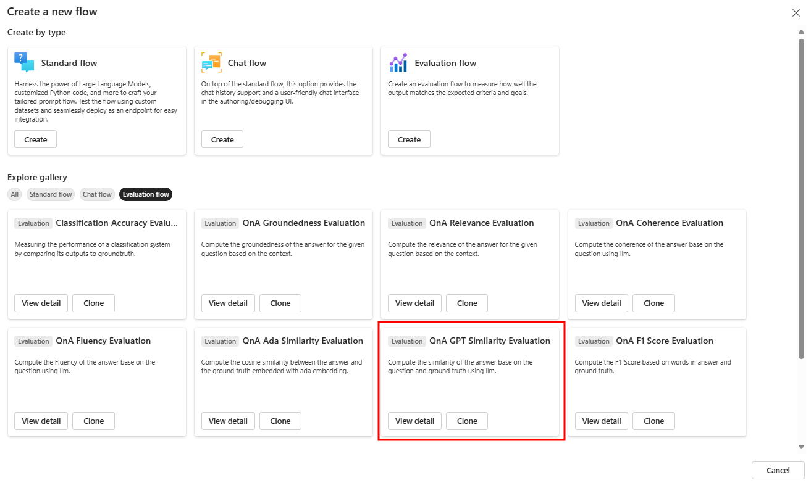

    > Note that the LLM nodes, where you will set the Azure OpenAI connection for each flow, have slightly different names: **relevance_score** and **similarity_score**, respectively.

## :rocket: Lab Steps

<a href="#loudspeaker-evaluating-and-deploying-llms">↥ back to top</a>

#### :rocket: 1) Evaluate your Chat flow

<a href="#loudspeaker-evaluating-and-deploying-llms">↥ back to top</a>

During this section, you will clone and modify the previously created `Multi-Round Q&A on Your Data ***` flow from [Lesson 2](../lesson_02/lab02.md) to include additional output and be evaluated. Once you are satisfied, you will archive the old Multi-Round Q&A flow.

[comment]: Reword above

1. In your browser, navigate to https://ai.azure.com.

1. Select your AI project.

1. Then, in the **Build** menu, select the **Prompt flow** page.

1. Open the `Multi-Round Q&A on Your Data ***` flow that you created in [Lesson 2](../lesson_02/lab02.md). 

    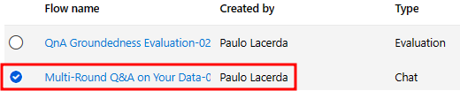

1. Click **Clone** to clone the flow, preserving the existing state of the lesson 2 flow. Enter the **Folder name** `Multi-Round Q&A on Your Data with Evaluations'. Then, click **Clone** again.

    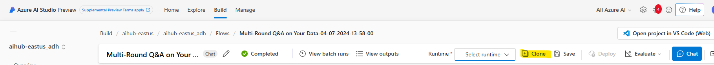

    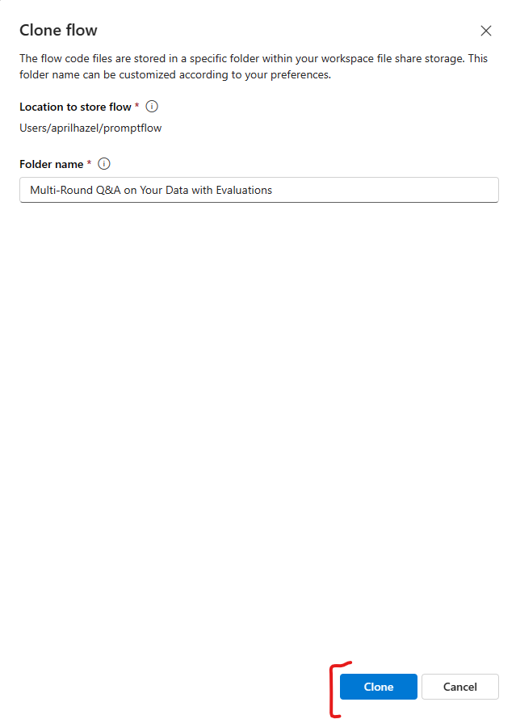

1. Start the automatic runtime by selecting **Start** in the **Runtime** drop down. The runtime will be useful for you to work with the flow moving forward.

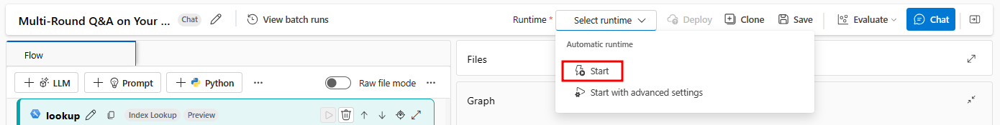

1. In the `Outputs` node, create a new output named `documents`. This output will represent the documents that were retrieved in the `lookup` node and subsequently formatted in the `generate_prompt_context` node.

1. Assign the documents value to `${generate_prompt_context.output}`, as shown in the image below.

    

1. Click **Save**.

1. Select the **Custom evaluation** option in the **Evaluate** dropdown menu.

    :exclaimation: The runtime must be started prior to this step. If it is not started, wait for it to successfully start. 

    

1. In the `Prompt_variants` option, ensure you are only selecting **two variants** to avoid overly taxing your quota limit, as shown in the example image below. Then, select **Next**.

    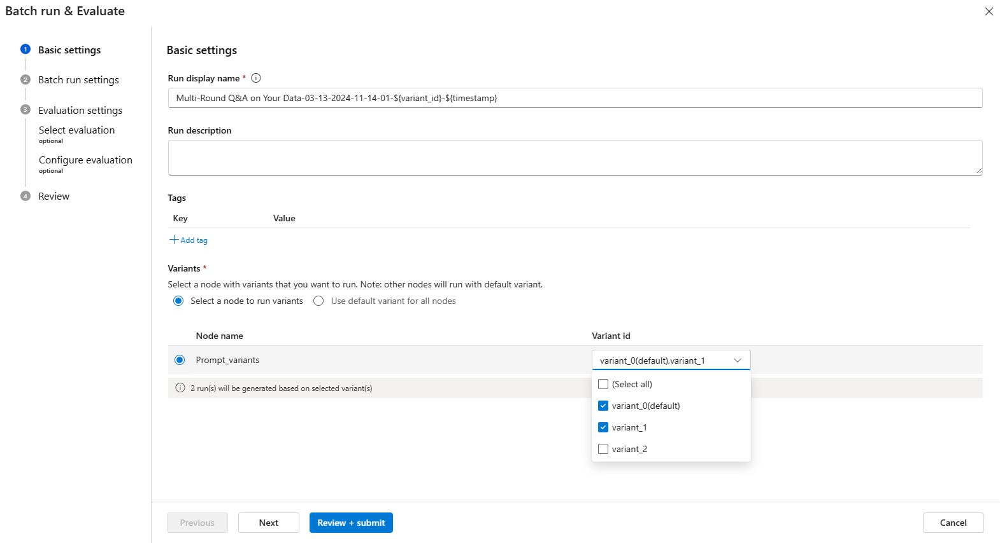

1. Click this link to download the [data.csv](./data.csv) file.

1. Select **Add new data**. Then, enter the Name `testdata` and **Browse** to the `data.csv` file you downloaded in the previous step. Click **Add**.

    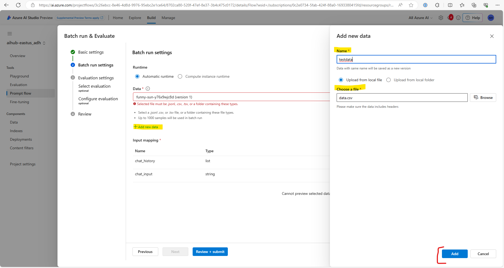

1. Ensure the **Input mapping** has the below values by selecting from the appropriate dropdown list. Click **Next** when finished.

    - chat_history: `${data.chat_history}`
    - chat_input: `${data.question}`

    

1. Check the three evaluation flows you just created that appear under the **Customized evaluation** section. Click **Next**.

    

1. Set up the `question`, `context`, `ground_truth` and `answer` fields for each of the 3 evaluation flows.

    :exclaimation: Please take a moment to ensure you've selected the correct value - it's crucial for accurate metric calculation.

    1. For the **QnA GPT :red_circle: Similarity :red_circle: Evaluation** flow, make the following selections.

        - **Choose data asset for evaluation**: `testdata (version 1)`
        - **question**: `${data.question}`
        - **ground_truth**: `${data.answer}`
        - **answer**: `${run.outputs.chat_output}`
        - **Connection**: The connection name used for the chat model for this workshop, likely `Default_AzureOpenAI`.
        - **Deployment name/Model**: The deployment name used for the chat model for this workshop

        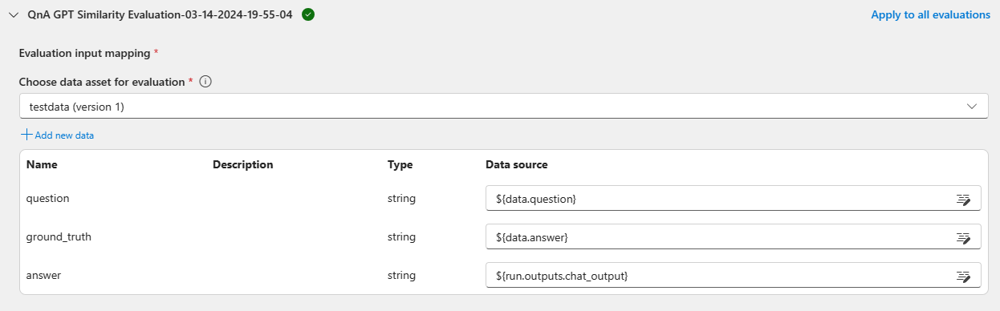

        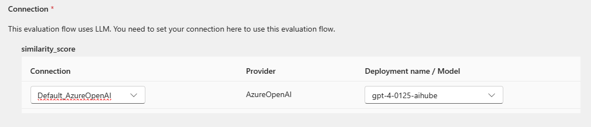

    1. For the **QnA GPT :red_circle: Groundedness :red_circle: Evaluation** flow, make the following selections.
    
        - **Choose data asset for evaluation**: `testdata (version 1)`
        - **question**: `${data.question}`
        - **context**: `${run.outputs.documents}`
        - **answer**: `${run.outputs.chat_output}`
        - **Connection**: The connection name used for the chat model for this workshop, likely `Default_AzureOpenAI`.
        - **Deployment name/Model**: The deployment name used for the chat model for this workshop

        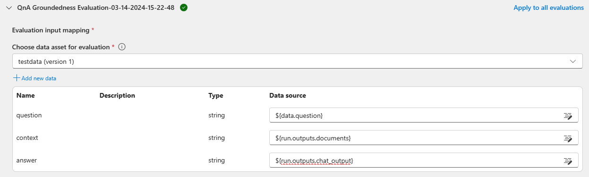

        

    1. For the **QnA GPT :red_circle: Relevance :red_circle: Evaluation** flow, make the following selections.
    
        - **Choose data asset for evaluation**: `testdata (version 1)`
        - **question**: `${data.question}`
        - **context**: `${run.outputs.documents}`
        - **answer**: `${run.outputs.chat_output}`
        - **Connection**: The connection name used for the chat model for this workshop, likely `Default_AzureOpenAI`.
        - **Deployment name/Model**: The deployment name used for the chat model for this workshop

        

        

1. Click on **Review + Submit**. Then, click the **Submit** button to start the evaluation.

    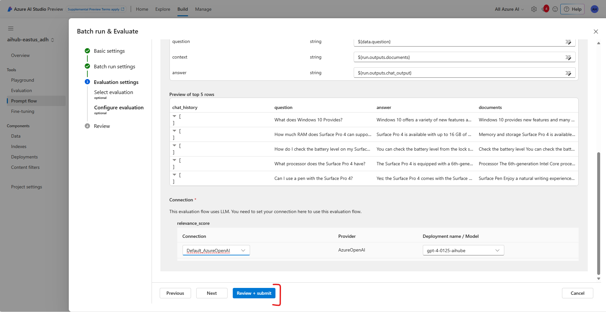

1. The evaluation process has started. To view all evaluations (one per variant), please navigate to the **Evaluation** section under the **Build** tab.

    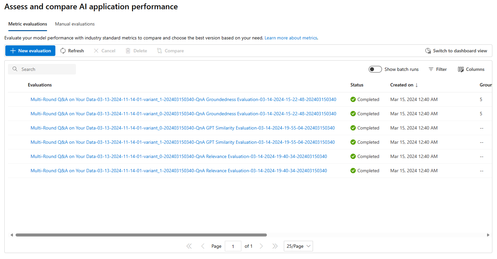

1. Select an evaluation result and observe that you have the ability to view an evaluation run's details. Explore the evaluation run detail capabilities by browsing the **Output**, **Logs**, **Trace**, and **Code** tabs.

    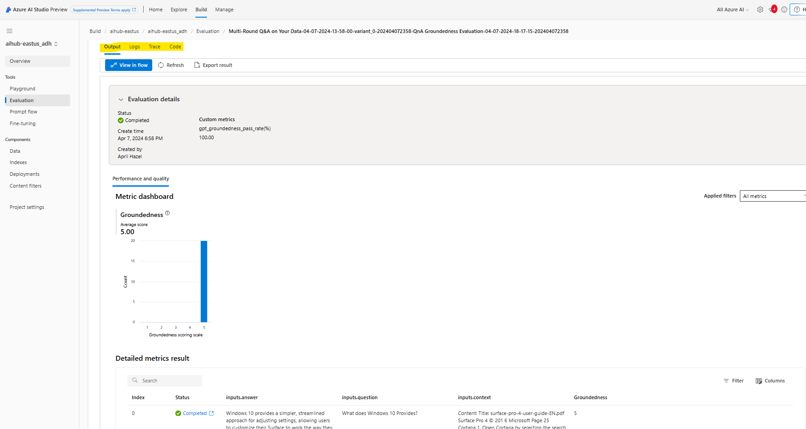

1. On the **Build** tab **Evaluation** page, click **Switch to dashboard view** to access a dashboard that provides a tabular and visual comparison between the rounds of different variations, as shown in the following images.

    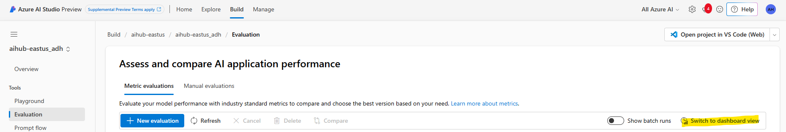

    *Table comparison*

    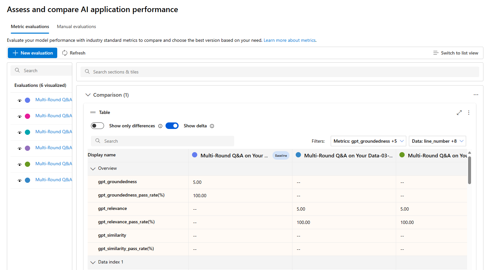

    *Chart comparison*

    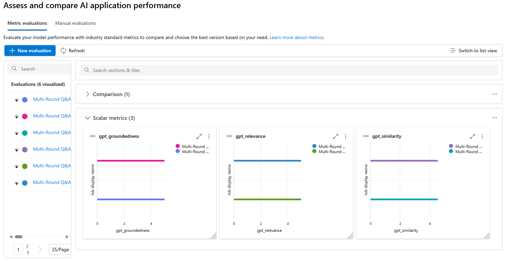

1. Assuming the flow is fully functional, archive the version from Lesson 2 for `Multi-Round Q&A on Your Data [***Date Time]` flow the on the **Build** tab **Prompt Flow** page.

#### :rocket: 2) Deploy the RAG flow to an online managed endpoint

<a href="#loudspeaker-evaluating-and-deploying-llms">↥ back to top</a>

1. Then, in the **Build** menu, select the **Prompt flow** page and open the Flow named `Multi-Round Q&A on Your Data with Evaluations` from this lesson.

1. Follow the instructions indicated in [Deploy a flow as a managed online endpoint for real-time inference - Azure AI Studio | Microsoft Learn](https://learn.microsoft.com/en-us/azure/ai-studio/how-to/flow-deploy?tabs=azure-studio)/Create an online deployment.

