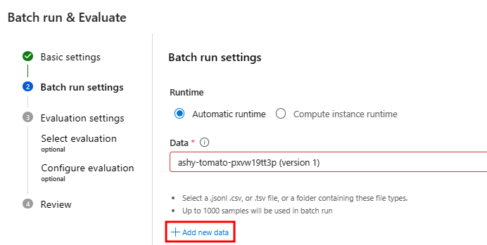
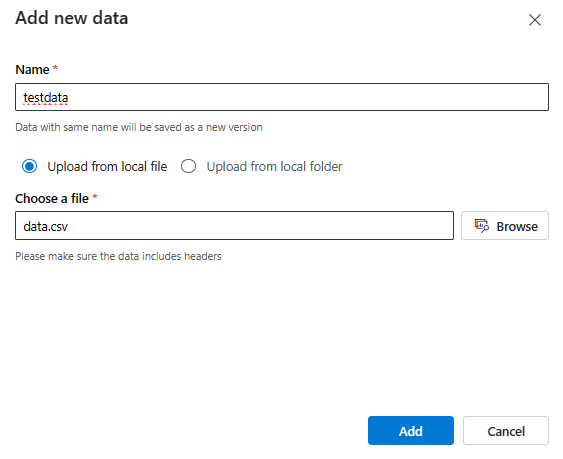
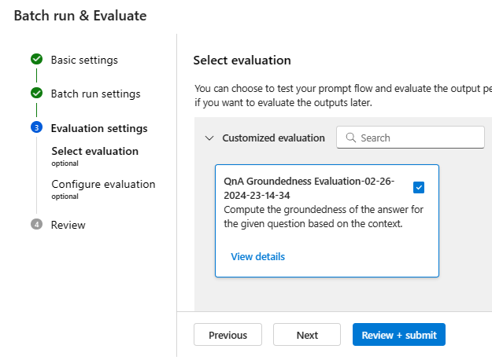
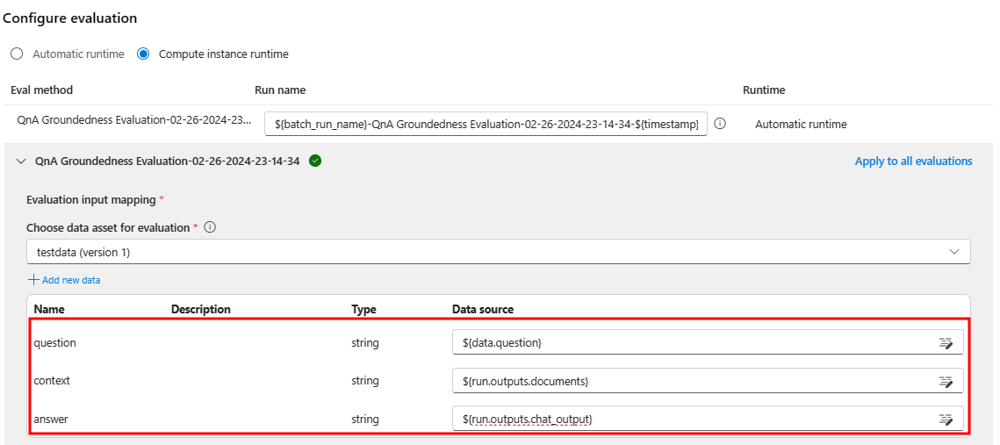
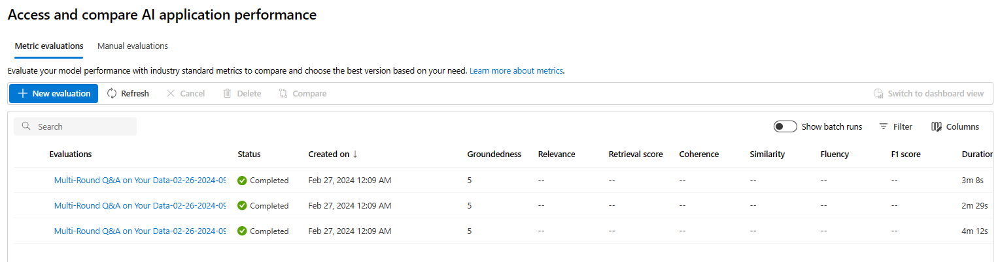

#### Evaluating and Deploying LLMs

In this Lab, you will execute the following steps:

1) Create an evaluation flow.

2) Deploy the RAG flow to an online managed endpoint.

#### Setup: Create a project in Azure AI Studio.

If you have already completed the Lab from lesson 1, you don't need to worry about this step.

Otherwise, simply execute step 1 of lesson 1, which is to create a project in Azure AI Studio.

In addition to creating the project, it will also be necessary to create a deployment for a gpt-4 model to run the evaluation flow.

#### 1) Create an evaluation flow

Go to your browser and type: https://ai.azure.com

Enter the Build menu and then select the Prompt flow option and click on the blue **Create** button.

Select the **Evaluation Flow** filter and then **QnA Groundedness Evaluation**.

> Note: you may need to click **View more samples** to find the QnA Groundedness Evaluation template.

Clone the flow.

A flow will be created with the following structure:

Update the Connection field to point to a gpt-4 deployment in `groundedness_score` node also update max_tokens to `1000` as shown in the next figure.  
   

After updating the connection information, **Save** the evaluation flow and navigate to the Flows section in Prompt Flow.

In the Flows section of Prompt Flow, open the **Multi-Round Q&A on Your Data** flow that you created in the previous lab. This will be the flow we use for evaluation.

Add a new output to the flow with the documents obtained from retrieval.

This flow output should correspond to the output of the node that generates the final prompt context.

Select the **Custom evaluation** option in the Evaluate menu.

In the `Prompt_variants` option, select the option to run all prompt variations.

Select **Add new data**.

Upload the file data.csv inside the lesson_03 folder.

After clicking on **Add**  proceed to map the input fields as shown below: 

Select the evaluation flow you just created.

Select **Next** to configure the `question`, `context` and `answer` fields to be used during the evaluation as in the screen below.

Click on Submit.

The evaluation process has started. To view all evaluations (one per variant), please navigate to the **Evaluation** section under the **Build** tab.

Upon selecting specific evaluation results, you will have the ability to view their detailed information or compare results between different variants.

#### 2) Deploy the RAG flow to an online managed endpoint

Open the **Multi-Round Q&A on Your Data** flow that you created in the previous lab.

After opening the flow, follow the instructions indicated in this link:

https://learn.microsoft.com/en-us/azure/ai-studio/how-to/flow-deploy