#### Evaluating and Deploying LLMs

In this Lab, you will execute the following steps:

1) Create an evaluation flow.

2) Deploy the flow to an online managed endpoint.

#### Setup: Create a project in Azure AI Studio.

If you have already completed the Lab from lesson 1, you don't need to worry about this step.

Otherwise, simply execute step 1 of lesson 1, which is to create a project in Azure AI Studio.

In addition to creating the project, it will also be necessary to create a deployment for a gpt-4 model to run the evaluation flow.

#### 1) Create an evaluation flow

Go to your browser and type: https://ai.azure.com

Enter the Build menu and then select the Prompt flow option and click on the blue Create button.

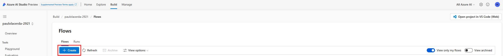

Select the **Evaluation Flow** filter and then **QnA RAG Evaluation**.

> Note: you may need to click **View more samples** to find the QnA RAG Evaluation template.

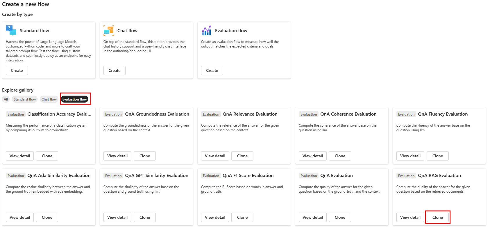

Clone the flow.

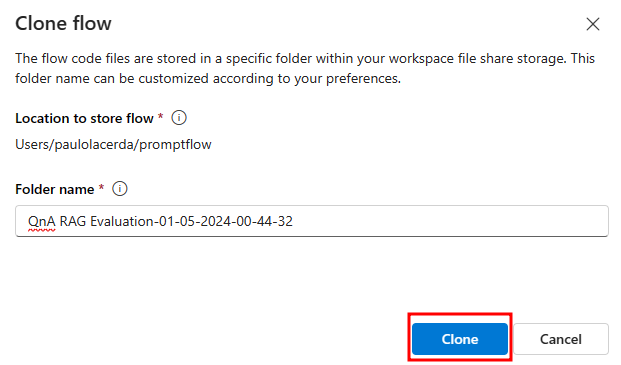

A flow will be created with the following structure:

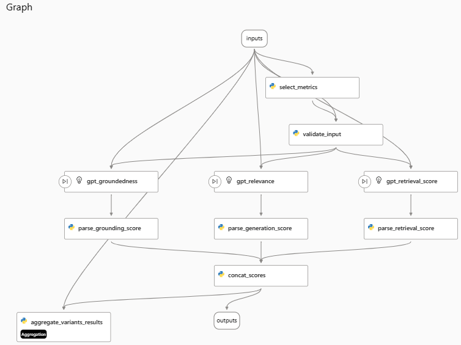

Update the Connection field to point to a gpt-4 deployment in each LLM node (`gpt_groundedness`, `gpt_relevance` and `gpt_retrieval_score`).  
   
For example:

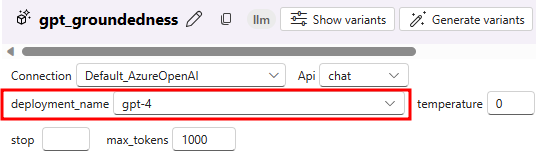

In the Flows section of Prompt Flow, open the **Multi-Round Q&A on Your Data** flow that you created in the previous lab. This will be the flow we use for evaluation.

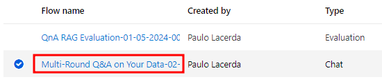

Add a new output to the flow with the documents obtained from retrieval.

This flow output should correspond to the output of the node that generates the final prompt context.

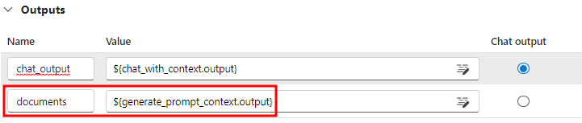

Select the **Custom evaluation** option in the Evaluate menu.

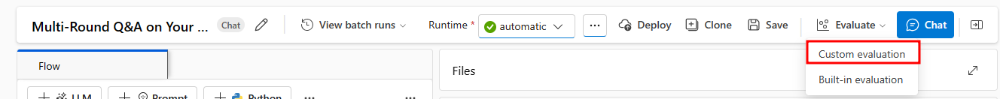

In the `Prompt_variants` option, select the option to run all prompt variations.

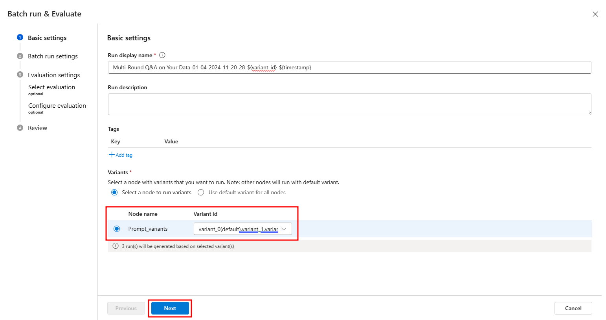

Select **Add new data** to upload the file data.csv inside the lesson_03 folder, and then proceed to map the input fields as shown below: 

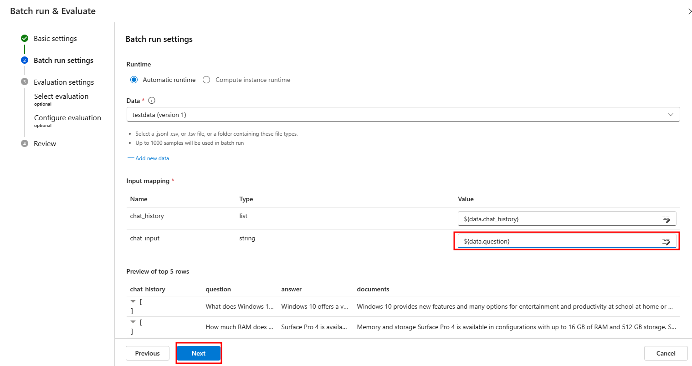

Select the evaluation flow you just created.

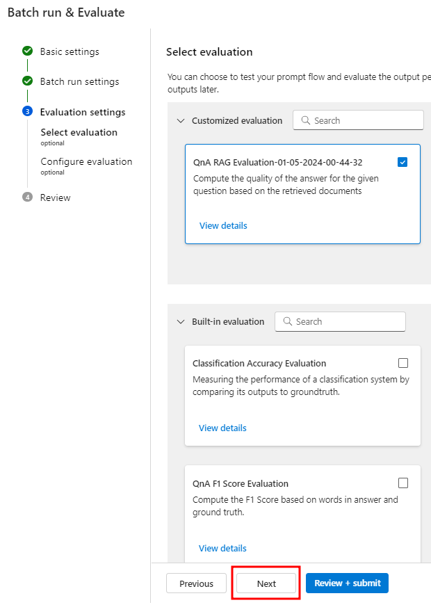

Configure the `metrics`, `answer`, `question` and `documents` fields to be used during the evaluation as in the screen below.

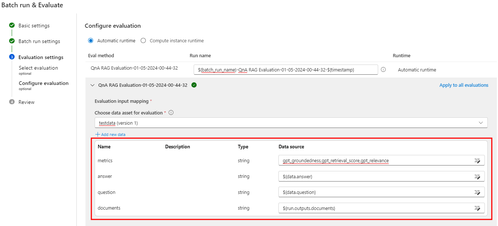

Click on Submit.

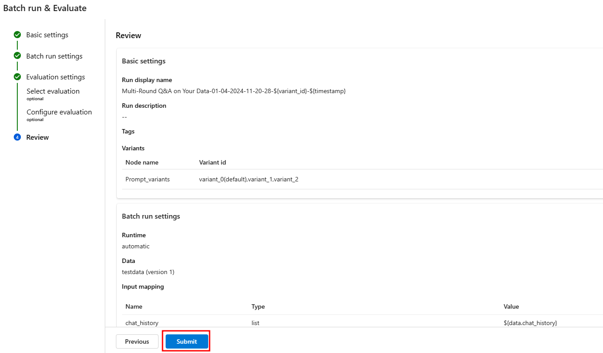

Great! The evaluation process has started. To view all evaluations (one per variant), please navigate to the **Evaluation** section under the **Build** tab.

Upon selecting specific evaluation results, you will have the ability to view their detailed information.

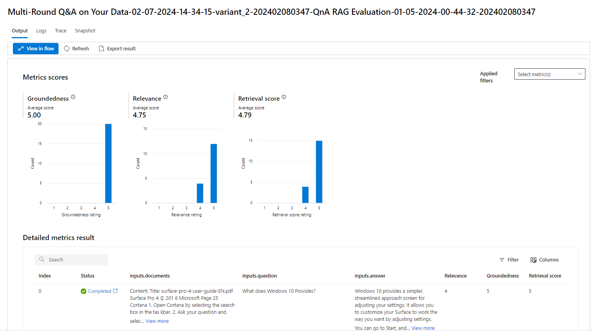

#### 2) Deploy the flow to an online managed endpoint

For this step, let's follow the instructions indicated in this link:

https://learn.microsoft.com/en-us/azure/ai-studio/how-to/flow-deploy