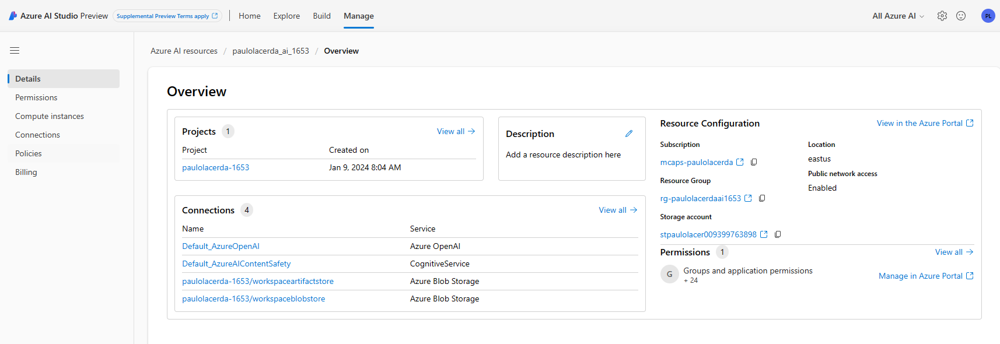
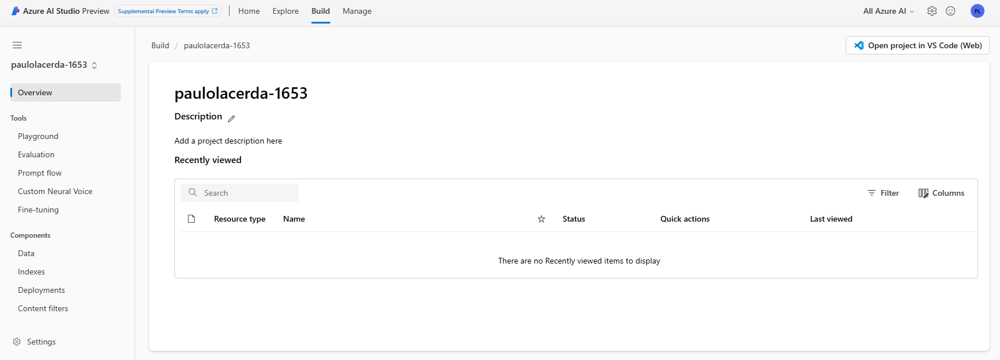

####  Team Collaboration

In this Lab, you will learn about project organization and administration.

#### Prerequisites

An Azure subscription where you can create an AI Hub Resource and a AI Search service.

#### Setup

No setup needed.

#### Concepts

*Azure AI Resource*  
   
The Azure AI Resource is the main Azure resource for AI Studio. It provides a working environment for teams to build and manage AI applications. It allows access to multiple Azure AI services in a single setup and includes features for billing, security configuration, and monitoring.  
   
*Azure AI projects*  
   
Azure AI projects are organizational containers that provide tools for AI customization and orchestration. They allow you to organize your work, save state across different tools (such as prompt flow), and collaborate with others. Projects also help you keep track of billing, manage access, and provide data isolation.  
   
*Azure AI Service*  
   
The Azure AI Service offers a unified endpoint and API Keys to access multiple services, such as Azure OpenAI, Content Safety, Speech, and Vision. These services are shared across all projects, providing a centralized and efficient way to access them.  
   
*Storage Account*  
   
The Storage Account stores artifacts for your projects, such as flows and evaluations. To ensure data isolation, storage containers are prefixed using the project GUID, and they are conditionally secured for the project identity.  
   
*Key Vault*  
   
The Key Vault is used to store secrets, such as connection strings for your resource connections. To maintain data isolation, secrets cannot be retrieved across projects via APIs, ensuring the security of your sensitive information.  
   
*Container Registry*  
   
The Container Registry stores Docker images that are created when using the custom runtime for prompt flow. To ensure data isolation, Docker images are prefixed using the project GUID, allowing for easy identification and management.  
   
*Application Insights*  
   
Application Insights is used as a log storage option when you choose to enable application-level logging for your deployed prompt flows. It provides a centralized location to store and analyze logs for monitoring and troubleshooting purposes.  
   
*Log Analytics Workspaces*  
   
Log Analytics Workspaces serve as the backing storage for application insights, handling log ingestion. They provide a scalable and reliable solution for storing and analyzing log data from your AI applications.

*AI Project and AI Resource RBAC*

https://learn.microsoft.com/en-us/azure/ai-studio/concepts/rbac-ai-studio

#### Lab Steps

Create a new AI Project and Resource, and explore each in AI Studio.

*AI Resource*  
   

   
*AI Project*   
  
